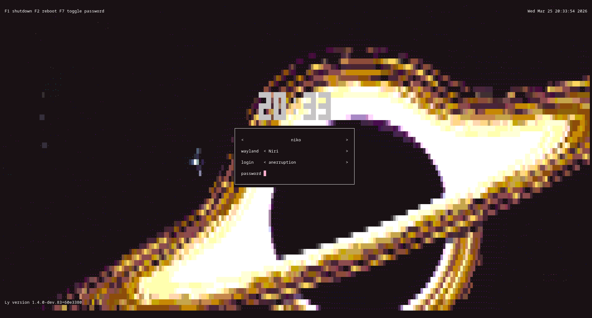

# Ly - a TUI display manager

## Development is now continuing on [Codeberg](https://codeberg.org/AnErrupTion/ly), with the [GitHub](https://github.com/fairyglade/ly) repository becoming a mirror. Issues & pull requests on GitHub will be ignored from now on.



Ly is a lightweight TUI (ncurses-like) display manager for Linux and BSD.

## Dependencies
- Compile-time:
  - zig 0.14.0
  - libc
  - pam
  - xcb (optional, required by default; needed for X11 support)
- Runtime (with default config):
  - xorg
  - xorg-xauth
  - shutdown
  - brightnessctl

### Debian
```
# apt install build-essential libpam0g-dev libxcb-xkb-dev
```

### Fedora
**Warning**: You may encounter issues with SELinux on Fedora.
It is recommended to add a rule for Ly as it currently does not ship one.

```
# dnf install kernel-devel pam-devel libxcb-devel zig
```

## Support
The following desktop environments were tested with success:

[Wayland Environments](#supported-wayland-environments)

[X11 Environments](#supported-x11-environments)

Ly should work with any X desktop environment, and provides
basic wayland support (sway works very well, for example).

## systemd?
Unlike what you may have heard, Ly does not require `systemd`,
and was even specifically designed not to depend on `logind`.
You should be able to make it work easily with a better init,
changing the source code won't be necessary :)

## Cloning and Compiling
Clone the repository
```
$ git clone https://codeberg.org/AnErrupTion/ly
```

Change the directory to ly
```
$ cd ly
```

Compile
```
$ zig build
```

Test in the configured tty (tty2 by default)
or a terminal emulator (but authentication won't work)
```
$ zig build run
```

**Important**: Running Ly in a terminal emulator as root is *not* recommended. If you
want to properly test Ly, please enable its service (as described below) and reboot
your machine.

Install Ly for systemd-based systems (the default)
```
# zig build installexe
```

Instead of DISPLAY_MANAGER you need to add your DM:
- gdm.service
- sddm.service
- lightdm.service
```
# systemctl disable DISPLAY_MANAGER
```

Enable the service
```
# systemctl enable ly.service
```

If you need to switch between ttys after Ly's start you also have to
disable getty on Ly's tty to prevent "login" from spawning on top of it
```
# systemctl disable getty@tty2.service
```

### OpenRC
**NOTE 1**: On Gentoo, Ly will disable the `display-manager-init` service in order to run.

Clone, compile and test.

Install Ly and the provided OpenRC service
```
# zig build installexe -Dinit_system=openrc
```

Enable the service
```
# rc-update add ly
```

You can edit which tty Ly will start on by editing the `tty` option in the configuration file.

If you choose a tty that already has a login/getty running (has a basic login prompt),
then you have to disable getty, so it doesn't respawn on top of ly
```
# rc-update del agetty.tty2
```

**NOTE 2**: To avoid a console spawning on top on Ly, comment out the appropriate line from /etc/inittab (default is 2).

### runit
```
# zig build installexe -Dinit_system=runit
# ln -s /etc/sv/ly /var/service/
```

By default, ly will run on tty2. To change the tty it must be set in `/etc/ly/config.ini`

You should as well disable your existing display manager service if needed, e.g.:

```
# rm /var/service/lxdm
```

The agetty service for the tty console where you are running ly should be disabled.
For instance, if you are running ly on tty2 (that's the default, check your `/etc/ly/config.ini`)
you should disable the agetty-tty2 service like this:

```
# rm /var/service/agetty-tty2
```

### s6
```
# zig build installexe -Dinit_system=s6
```

Then, edit `/etc/s6/config/ttyX.conf` and set `SPAWN="no"`, where X is the TTY ID (e.g. `2`).

Finally, enable the service:

```
# s6-service add default ly-srv
# s6-db-reload
# s6-rc -u change ly-srv
```

### dinit
```
# zig build installexe -Dinit_system=dinit
# dinitctl enable ly
```

In addition to the steps above, you will also have to keep a TTY free within `/etc/dinit.d/config/console.conf`.

To do that, change `ACTIVE_CONSOLES` so that the tty that ly should use in `/etc/ly/config.ini` is free.

### Updating
You can also install Ly without overrding the current configuration file. That's called
*updating*. To update, simply run:

```
# zig build installnoconf
```

You can, of course, still select the init system of your choice when using this command.

## Arch Linux Installation
You can install ly from the [`[extra]` repos](https://archlinux.org/packages/extra/x86_64/ly/):
```
# pacman -S ly
```

## Gentoo Installation
You can install ly from the GURU repository:

Note: If the package is masked, you may need to unmask it using ~amd64 keyword:
```bash
# echo 'x11-misc/ly ~amd64' >> /etc/portage/package.accept_keywords
```

1. Enable the GURU repository:
```bash
# eselect repository enable guru
```

2. Sync the GURU repository:
```bash
# emaint sync -r guru
```

3. Install ly from source:
```bash
# emerge --ask x11-misc/ly
```

## Configuration
You can find all the configuration in `/etc/ly/config.ini`.
The file is commented, and includes the default values.

## Controls
Use the up and down arrow keys to change the current field, and the
left and right arrow keys to change the target desktop environment
while on the desktop field (above the login field).

## .xinitrc
If your .xinitrc doesn't work make sure it is executable and includes a shebang.
This file is supposed to be a shell script! Quoting from xinit's man page:

> If no specific client program is given on the command line, xinit will look for a file in the user's home directory called .xinitrc to run as a shell script to start up client programs.

On Arch Linux, the example .xinitrc (/etc/X11/xinit/xinitrc) starts like this:
```
#!/bin/sh
```

## Tips
- The numlock and capslock state is printed in the top-right corner.
- Use the F1 and F2 keys to respectively shutdown and reboot.
- Take a look at your .xsession if X doesn't start, as it can interfere
  (this file is launched with X to configure the display properly).

## Supported Wayland Environments
 - budgie
 - cosmic
 - deepin
 - enlightenment
 - gnome
 - hyprland
 - kde
 - labwc
 - niri
 - pantheon
 - sway
 - weston

## Supported X11 Environments
 - awesome
 - bspwm
 - budgie
 - cinnamon
 - dwm
 - enlightenment
 - gnome
 - kde
 - leftwm
 - lxde
 - mate
 - maxx
 - pantheon
 - qwm
 - spectrwm
 - windowmaker
 - xfce
 - xmonad


## Additional Information
The name "Ly" is a tribute to the fairy from the game Rayman.
Ly was tested by oxodao, who is some seriously awesome dude.
