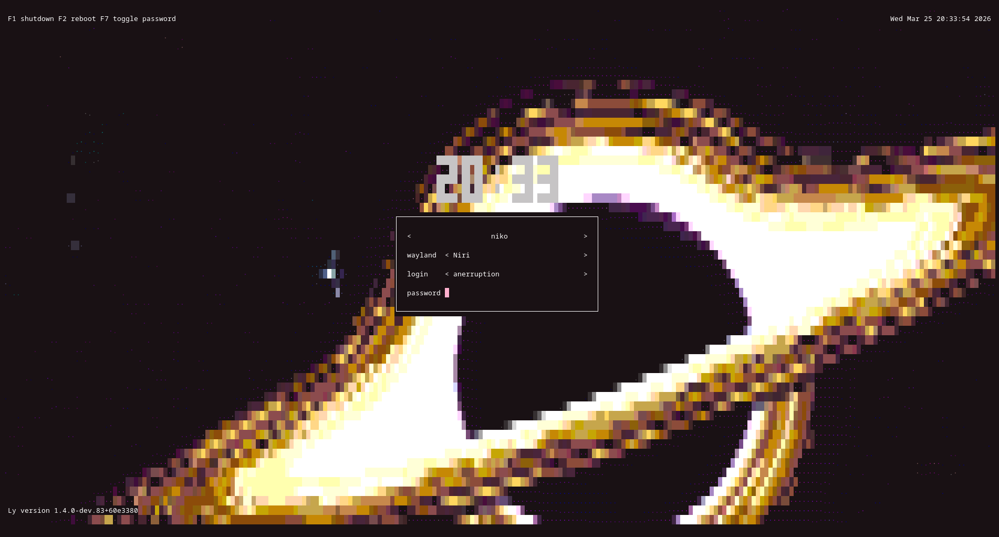

# The Ly display manager



Ly is a lightweight TUI (ncurses-like) display manager for Linux and BSD, designed with portability in mind and doesn't require systemd to run.

Join us on Matrix over at [#ly-dm:matrix.org](https://matrix.to/#/#ly-dm:matrix.org)!

> [!NOTE]
> Development happens on [Codeberg](https://codeberg.org/fairyglade/ly) with a mirror on [GitHub](https://github.com/fairyglade/ly).

## Dependencies

- Compile-time:
  - zig 0.15.x

  - libc

  - pam

  - xcb (optional, required by default; needed for X11 support)

- Runtime (with default config):
  - xorg

  - xorg-xauth

  - shutdown

  - brightnessctl

### Debian

```
# apt install build-essential libpam0g-dev libxcb-xkb-dev xauth xserver-xorg brightnessctl
```

### Fedora

> [!WARNING]
> You may encounter issues with SELinux on Fedora. It is recommended to add a rule for Ly as it currently does not ship one.

```
# dnf install kernel-devel pam-devel libxcb-devel zig xorg-x11-xauth xorg-x11-server brightnessctl
```

### FreeBSD

```
# pkg install ca_root_nss libxcb git xorg xauth
```

## Availability

[](https://repology.org/project/ly-display-manager/versions)

## Support

Every environment that works on other login managers also should work on Ly.

- Unlike most login managers Ly has an xinitrc and shell entry.

- If you installed your favorite environment and you don't see it, that's because Ly doesn't automatically refresh itself. To fix this you should restart Ly service (depends on your init system) or the easy way is to reboot your system.

- If your environment is still missing then check at `/usr/share/xsessions` or `/usr/share/wayland-sessions` to see if a .desktop file is present.

- If there isn't a .desktop file then create a new one at `/etc/ly/custom-sessions` that launches your favorite environment. These .desktop files can be only seen by Ly and if you want them system-wide you also can create at those directories instead.

- If Xorg sessions don't work then check if your distro compiles Ly with Xorg.

Logs are defined by `/etc/ly/config.ini`:

- The session log is located at `~/.local/state/ly-session.log` by default.

- The system log is located at `/var/log/ly.log` by default.

## Manually building

The procedure for manually building Ly is pretty standard:

```
$ git clone https://codeberg.org/fairyglade/ly.git
$ cd ly
$ zig build
```

After building, you can (optionally) test Ly in a terminal emulator, although authentication will **not** work:

```
$ zig build run
```

> [!IMPORTANT]
> While you can run Ly in a terminal emulator as root, it is **not** recommended. If you want to test Ly, please enable its service (as described below) and reboot your machine.

The next sections will explain how to use Ly with a variety of init systems. Detailed explanation is only given for systemd, but should be applicable for all.

> [!NOTE]
> All following sections will assume you are using LightDM for convenience sake.

### systemd

Now, you can install Ly on your system:

```
# zig build installexe -Dinit_system=systemd
```

> [!NOTE]
> The `init_system` parameter is optional and defaults to `systemd`.

Note that you also need to disable your current display manager. For example, if you are using LightDM, you can execute the following command:

```
# systemctl disable lightdm.service
```

Then, similarly to the previous command, you need to enable the Ly service:

```
# systemctl enable ly@tty2.service
```

> [!IMPORTANT]
> Because Ly runs in a TTY, you **must** disable the TTY service that Ly will run on, otherwise bad things will happen. For example, to disable `getty` spawning on TTY 2, you need to execute the following command:

```
# systemctl disable getty@tty2.service
```

On platforms that use systemd-logind to dynamically start `autovt@.service` instances when the switch to a new tty occurs, any ly instances for ttys _except the default tty_ need to be enabled using a different mechanism: To autostart ly on switch to `tty2`, do not enable any `ly` unit directly, instead symlink `autovt@tty2.service` to `ly@tty2.service` within `/usr/lib/systemd/system/` (analogous for every other tty you want to enable ly on).

The target of the symlink, `ly@ttyN.service`, does not actually exist, but systemd nevertheless recognizes that the instanciation of `autovt@.service` with `%I` equal to `ttyN` now points to an instanciation of `ly@.service` with `%I` set to `ttyN`.

Compare to `man 5 logind.conf`, especially regarding the `NAutoVTs=` and `ReserveVT=` parameters.

On non-systemd systems, you can change the TTY Ly will run on by editing the corresponding service file for your platform.

### OpenRC

```
# zig build installexe -Dinit_system=openrc
# rc-update del lightdm
# rc-update add ly
# rc-update del agetty.tty2
```

> [!NOTE]
> On Gentoo specifically, you also **must** comment out the appropriate line for the TTY in /etc/inittab.

### runit

```
# zig build installexe -Dinit_system=runit
# rm /var/service/lightdm
# ln -s /etc/sv/ly /var/service/
# rm /var/service/agetty-tty2
```

### s6

```
# zig build installexe -Dinit_system=s6
# s6-rc -d change lightdm
# s6-service add default ly-srv
# s6-db-reload
# s6-rc -u change ly-srv
```

To disable TTY 2, edit `/etc/s6/config/tty2.conf` and set `SPAWN="no"`.

### dinit

```
# zig build installexe -Dinit_system=dinit
# dinitctl disable lightdm
# dinitctl enable ly
```

To disable TTY 2, go to `/etc/dinit.d/config/console.conf` and modify `ACTIVE_CONSOLES`.

### sysvinit

```
# zig build installexe -Dinit_system=sysvinit
# update-rc.d lightdm disable
# update-rc.d ly defaults
```

To disable TTY 2, go to `/etc/inittab` and comment out the line containing `tty2`.

### FreeBSD

```
# zig build installexe -Dprefix_directory=/usr/local -Dconfig_directory=/usr/local/etc -Dinit_system=freebsd
# sysrc lightdm_enable="NO"
```

To enable Ly, add the following entry to `/etc/gettytab`:

```
Ly:\
	:lo=/usr/local/bin/ly_wrapper:\
	:al=root:
```

Then, modify the command field of the `ttyv1` terminal entry in `/etc/ttys` (TTYs in FreeBSD start at 0):

```
ttyv1 "/usr/libexec/getty Ly" xterm on secure
```

### Updating

You can also install Ly without overrding the current configuration file. This is called **updating**. To update, simply run:

```
# zig build installnoconf
```

You can, of course, still select the init system of your choice when using this command.

## Configuration

You can find all the configuration in `/etc/ly/config.ini`. The file is fully commented, and includes the default values.

## Controls

Use the Up/Down arrow keys to change the current field, and the Left/Right arrow keys to scroll through the different fields (whether it be the info line, the desktop environment, or the username). The info line is where messages and errors are displayed.

## A note on .xinitrc

If your `.xinitrc` file doesn't work ,make sure it is executable and includes a shebang. This file is supposed to be a shell script! Quoting from `xinit`'s man page:

> If no specific client program is given on the command line, xinit will look for a file in the user's home directory called .xinitrc to run as a shell script to start up client programs.

A typical shebang for a shell script looks like this:

```
#!/bin/sh
```

## Tips

- The numlock and capslock state is printed in the top-right corner.

- Use the F1 and F2 keys to respectively shutdown and reboot.

- Take a look at your `.xsession` file if X doesn't start, as it can interfere (this file is launched with X to configure the display properly).

## A final note

The name "Ly" is a tribute to the fairy from the game Rayman. Ly was tested by oxodao, who is some seriously awesome dude.

Also, Ly wouldn't be there today without [ashametrine](https://github.com/ashametrine), who has done significant contributions to the project for the Zig rewrite, which lead to the release of Ly v1.0.0. Massive thanks, and sorry for not crediting you enough beforehand!

### Donate

If you like Ly and wish to support my work further, feel free to donate via my
[Liberapay link](https://liberapay.com/ShiningLea)!
