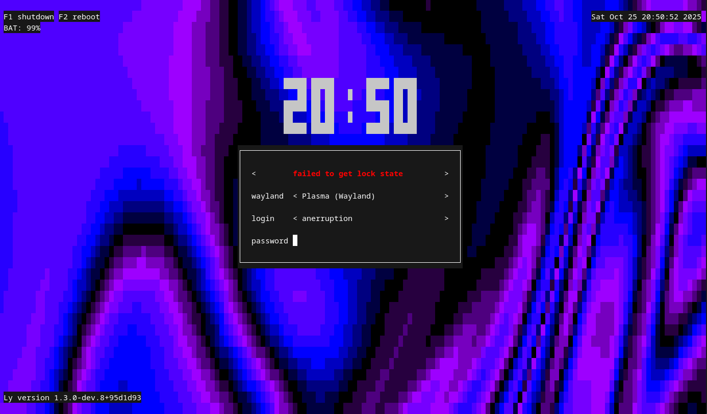

# The Ly display manager



Ly is a lightweight TUI (ncurses-like) display manager for Linux and BSD,
designed with portability in mind (e.g. it does not require systemd to run).

Join us on Matrix over at [#ly:envs.net](https://matrix.to/#/#ly:envs.net)!

**Note**: Development happens on [Codeberg](https://codeberg.org/fairyglade/ly)
with a mirror on [GitHub](https://github.com/fairyglade/ly).

## Dependencies

- Compile-time:
  - zig 0.15.x
  - libc
  - pam
  - xcb (optional, required by default; needed for X11 support)
- Runtime (with default config):
  - xorg
  - xorg-xauth
  - shutdown
  - brightnessctl

### Debian

```
# apt install build-essential libpam0g-dev libxcb-xkb-dev xauth xserver-xorg brightnessctl
```

### Fedora

**Warning**: You may encounter issues with SELinux on Fedora.
It is recommended to add a rule for Ly as it currently does not ship one.

```
# dnf install kernel-devel pam-devel libxcb-devel zig xorg-x11-xauth xorg-x11-server brightnessctl
```

## Packaging status

[](https://repology.org/project/ly/versions)

## Support

Ly has been tested with a wide variety of desktop environments and window
managers, all of which you can find in the sections below:

[Wayland environments](#supported-wayland-environments)

[X11 environments](#supported-x11-environments)

## Manually building

The procedure for manually building Ly is pretty standard:

```
$ git clone https://codeberg.org/fairyglade/ly.git
$ cd ly
$ zig build
```

After building, you can (optionally) test Ly in a terminal emulator, although
authentication will **not** work:

```
$ zig build run
```

**Important**: While you can also run Ly in a terminal emulator as root, it is
**not** recommended either. If you want to properly test Ly, please enable its
service (as described below) and reboot your machine.

The following sections show how to install Ly for a particular init system.
Because the procedure is very similar for all of them, the commands will only
be detailed for the first section (which is about systemd).

**Note**: All following sections will assume you are using LightDM for
convenience sake.

### systemd

Now, you can install Ly on your system:

```
# zig build installexe -Dinit_system=systemd
```

**Note**: The `init_system` parameter is optional and defaults to `systemd`.

Note that you also need to disable your current display manager. For example,
if LightDM is the current display manager, you can execute the following
command:

```
# systemctl disable lightdm.service
```

Then, similarly to the previous command, you need to enable the Ly service:

```
# systemctl enable ly.service
```

**Important**: Because Ly runs in a TTY, you **must** disable the TTY service
that Ly will run on, otherwise bad things will happen. For example, to disable `getty` spawning on TTY 2 (the default TTY on which Ly spawns), you need to
execute the following command:

```
# systemctl disable getty@tty2.service
```

You can change the TTY Ly will run on by editing the `tty` option in the
configuration file **and** change which TTY is used in the corresponding
service file..

### OpenRC

```
# zig build installexe -Dinit_system=openrc
# rc-update del lightdm
# rc-update add ly
# rc-update del agetty.tty2
```

**Note**: On Gentoo specifically, you also **must** comment out the appropriate
line for the TTY in /etc/inittab.

### runit

```
# zig build installexe -Dinit_system=runit
# rm /var/service/lightdm
# ln -s /etc/sv/ly /var/service/
# rm /var/service/agetty-tty2
```

### s6

```
# zig build installexe -Dinit_system=s6
# s6-rc -d change lightdm
# s6-service add default ly-srv
# s6-db-reload
# s6-rc -u change ly-srv
```

To disable TTY 2, edit `/etc/s6/config/tty2.conf` and set `SPAWN="no"`.

### dinit

```
# zig build installexe -Dinit_system=dinit
# dinitctl disable lightdm
# dinitctl enable ly
```

To disable TTY 2, go to `/etc/dinit.d/config/console.conf` and modify
`ACTIVE_CONSOLES`.

### sysvinit

```
# zig build installexe -Dinit_system=sysvinit
# update-rc.d lightdm disable
# update-rc.d ly defaults
```

To disable TTY 2, go to `/etc/inittab` and comment out the line containing `tty2`.

### Updating

You can also install Ly without overrding the current configuration file. This
is called **updating**. To update, simply run:

```
# zig build installnoconf
```

You can, of course, still select the init system of your choice when using this
command.

## Configuration

You can find all the configuration in `/etc/ly/config.ini`. The file is fully
commented, and includes the default values.

## Controls

Use the Up/Down arrow keys to change the current field, and the Left/Right
arrow keys to scroll through the different fields (whether it be the info line,
the desktop environment, or the username). The info line is where messages and
errors are displayed.

## A note on .xinitrc

If your `.xinitrc` file doesn't work ,make sure it is executable and includes a
shebang. This file is supposed to be a shell script! Quoting from `xinit`'s man
page:

> If no specific client program is given on the command line, xinit will look
> for a file in the user's home directory called .xinitrc to run as a shell
> script to start up client programs.

A typical shebang for a shell script looks like this:

```
#!/bin/sh
```

## Tips

- The numlock and capslock state is printed in the top-right corner.
- Use the F1 and F2 keys to respectively shutdown and reboot.
- Take a look at your `.xsession` file if X doesn't start, as it can interfere
  (this file is launched with X to configure the display properly).

## Supported Wayland environments

- budgie
- cosmic
- deepin
- enlightenment
- gnome
- hyprland
- kde
- labwc
- niri
- pantheon
- sway
- weston

## Supported X11 environments

- awesome
- bspwm
- budgie
- cinnamon
- dwm
- enlightenment
- gnome
- kde
- leftwm
- lxde
- mate
- maxx
- pantheon
- qwm
- spectrwm
- windowmaker
- xfce
- xmonad

## A final note

The name "Ly" is a tribute to the fairy from the game Rayman. Ly was tested by
oxodao, who is some seriously awesome dude.
